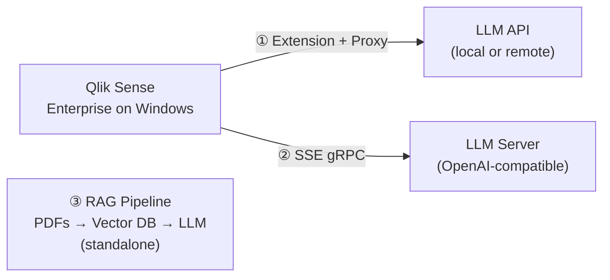

# Qlik Sense on Windows — LLM Integration Patterns

Qlik Cloud delivers AI-assisted analytics natively — Insight Advisor, natural language queries, and AI-generated summaries are available out of the box.

Organizations running **Qlik Sense Enterprise on Windows** follow a different release cycle and do not have access to these cloud-native AI features by default.

This does not mean AI integration is impossible. It means it requires architecture.

This repository documents two direct integration patterns for Qlik Sense on Windows, plus a standalone RAG pipeline that explores the architecture behind document AI systems like Qlik Answers. Each pattern addresses a different business problem and is compatible with any OpenAI-compatible LLM — local (LM Studio, Ollama) or remote (OpenAI, Anthropic, Azure OpenAI).

> **These are reference architectures, not a code library.** The goal is to show that these integrations are possible and production-tested. How you implement them is up to you.

---

## Why on-premises?

Many organizations in regulated industries — financial services, healthcare, energy — cannot or choose not to send business data to a public cloud API. Running the LLM on-premises (or in a private cloud) keeps data within the organization's boundary.

These patterns were designed with that constraint in mind.

---

## Three patterns

| # | Pattern | What it enables | Type |
|---|---------|----------------|------|
| 1 | [AI Assistant on Dashboards](docs/pattern-1-extension-proxy.md) | Ask questions about chart data in natural language | Qlik integration |
| 2 | [LLM in Qlik Expressions](docs/pattern-2-sse-expressions.md) | Use LLM output in load scripts and expressions | Qlik integration |
| 3 | [Ask Your Documents](docs/pattern-3-rag-documents.md) | Query internal PDF documents using natural language | Standalone RAG pipeline |

---

## High-level architecture

Patterns 1 and 2 integrate directly with the Qlik Engine. Pattern 3 is a standalone pipeline with no dependency on Qlik Sense — included here as a practical exploration of the RAG architecture behind document AI systems.

---

## Screenshots

Screenshots of each pattern running in Qlik Sense are planned for a future update. Stay tuned to the [`screenshots/`](screenshots/) folder.

---

## Tested on

- Qlik Sense Enterprise on Windows
- LM Studio with local models (Llama, Mistral)
- Anthropic Claude API

---

## Author

Miguel A. Baeyens · [linkedin.com/in/mabaeyens](https://linkedin.com/in/mabaeyens)
