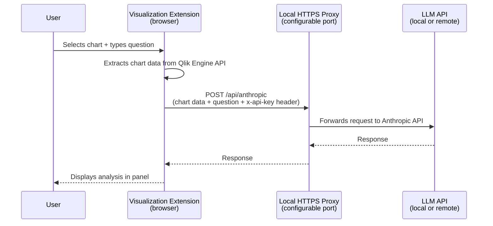

# Pattern 1 — AI Assistant on Dashboards

## Business problem

Users want to ask questions about the data in their Qlik Sense dashboards without leaving the application. The question should be answered in the context of the actual data visible on screen — not a generic LLM response.

**Example:** A sales manager opens a revenue-by-region chart and asks: *"Which regions are underperforming compared to last quarter, and what could be causing it?"*

The extension extracts the actual chart data from the Qlik engine and sends it to the LLM as context. The answer is grounded in the numbers on screen.

---

## Architecture

---

## Why the proxy?

Qlik Sense on Windows runs in a browser. Browsers enforce **[CORS (Cross-Origin Resource Sharing)](https://developer.mozilla.org/en-US/docs/Web/HTTP/CORS)** restrictions: a page served from `https://qlik-server` cannot call `https://api.anthropic.com` or any other external API directly.

A local HTTPS proxy running on the Qlik server (or on the client machine) solves this: the browser calls `https://localhost`, which is allowed, and the proxy forwards the request to the LLM API.

This is the key architectural constraint that makes the proxy mandatory for browser-based Qlik extensions — and it applies to any LLM API, not just Anthropic.

---

## Components

| Component | Role | Technology |
|-----------|------|-----------|
| Visualization Extension | Captures chart data, renders the AI panel, sends requests | JavaScript (Qlik RequireJS) |
| Local HTTPS Proxy | Bridges the CORS gap, forwards requests to the LLM | Node.js / Express |
| LLM API | Generates natural language analysis from chart data | Any OpenAI-compatible API |

---

## Data flow

1. The user selects a visualization and types a question in the extension panel.
2. The extension calls the Qlik Engine API to extract the current chart data (rows, dimensions, measures).
3. The data is formatted into a prompt and sent to the local proxy via HTTPS POST, with the API key in the `x-api-key` request header.
4. The proxy reads the header and forwards the request — with the API key — to the LLM API.
5. The LLM response is returned through the proxy and rendered in the extension panel.

---

## Key considerations

**API key handling:** The user enters the API key once in the extension settings. It is stored in browser `localStorage`, scoped to the Qlik app ID (`anthropic_api_key_{appId}`), and retrieved on each request. It travels as the `x-api-key` header from the browser to the proxy, which forwards it to the LLM API. The key never appears in the Qlik app itself or in the proxy configuration.

**Data volume:** Qlik charts can return thousands of rows. The extension applies a configurable row limit before sending data to avoid exceeding model token limits. In practice, 500–1000 rows are sufficient for most analytical questions.

**SSL certificates:** The proxy uses HTTPS with a self-signed certificate. The certificate must be trusted by the browser and accepted by Qlik Sense to avoid TLS errors. This is a one-time setup step on each machine.

**Port:** The proxy port is configurable via environment variable (default: 3000). The allowed origin (your Qlik Sense server URL) is also configured at the proxy level to restrict CORS access.

**Model selection:** Any model accessible via an OpenAI-compatible API works. Faster, lower-cost models (e.g. Claude Haiku, GPT-4o mini) are well suited for interactive use given the conversational latency expectations.

---

## Prerequisites

- Qlik Sense Enterprise on Windows (also compatible with Qlik Sense Desktop)
- Node.js runtime on the machine running the proxy
- Access to an LLM API (local or remote, OpenAI-compatible)
- Browser trust configured for the self-signed SSL certificate

---

## Limitations and scaling considerations

**On-premises scaling:** This pattern was designed for individual or small-team use. Scaling it to many concurrent users introduces practical constraints: each LLM request can take several seconds, and LLM API rate limits impose an upper bound on throughput. The local proxy has no authentication layer, request queuing, or rate-limiting of its own. For organization-wide deployment, a production-grade service with proper access control and error handling would be needed.

**Context scope:** The context provided to the LLM is limited to the data visible in a single Qlik chart — rows, dimensions, measures — plus basic data model metadata (table names, column names, field relationships). This is a narrow slice of the full application context. By contrast, [Qlik Answers](https://help.qlik.com/en-US/cloud-services/Subsystems/Hub/Content/Sense_Hub/QlikAnswers/Qlik-Answers.htm) can leverage the complete semantic layer of a Qlik app, including all field associations and business logic embedded in the data model. For analytical questions that require broader application context, this architecture has inherent limitations.

**Next steps:** A natural extension of this pattern is to combine chart-level context with document-level knowledge through RAG (Retrieval-Augmented Generation). Ideas for this approach are developed in [Pattern 3](pattern-3-rag-documents.md).
