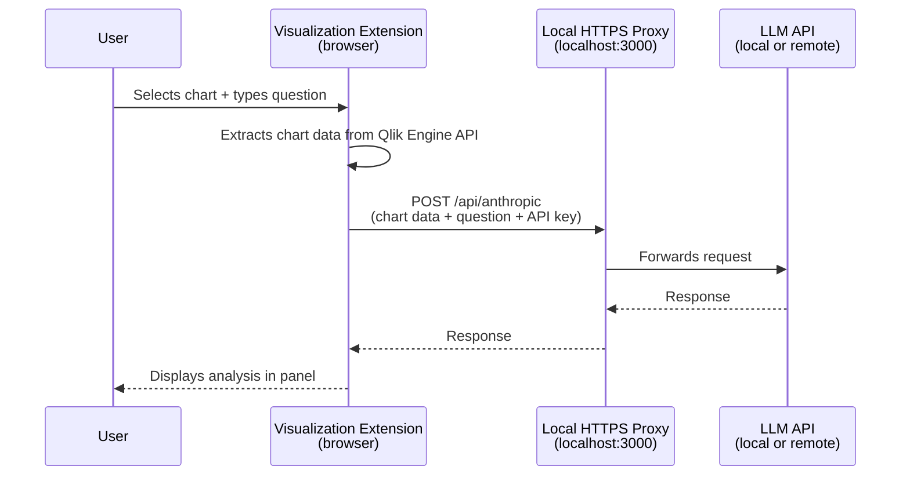

# Pattern 1 — AI Assistant on Dashboards

## Business problem

Users want to ask questions about the data in their Qlik Sense dashboards without leaving the application. The question should be answered in the context of the actual data visible on screen — not a generic LLM response.

**Example:** A sales manager opens a revenue-by-region chart and asks: *"Which regions are underperforming compared to last quarter, and what could be causing it?"*

The extension extracts the actual chart data from the Qlik engine and sends it to the LLM as context. The answer is grounded in the numbers on screen.

---

## Architecture

---

## Why the proxy?

Qlik Sense on Windows runs in a browser. Browsers enforce **CORS (Cross-Origin Resource Sharing)** restrictions: a page served from `https://qlik-server` cannot call `https://api.anthropic.com` or any other external API directly.

A local HTTPS proxy running on the Qlik server (or on the client machine) solves this: the browser calls `https://localhost:3000`, which is allowed, and the proxy forwards the request to the LLM API.

This is the key architectural constraint that makes the proxy mandatory for browser-based Qlik extensions — and it applies to any LLM API, not just Anthropic.

---

## Components

| Component | Role | Technology |
|-----------|------|-----------|
| Visualization Extension | Captures chart data, renders the AI panel, sends requests | JavaScript (Qlik RequireJS) |
| Local HTTPS Proxy | Bridges the CORS gap, forwards requests to the LLM | Node.js / Express |
| LLM API | Generates natural language analysis from chart data | Any OpenAI-compatible API |

---

## Data flow

1. The user selects a visualization and types a question in the extension panel.
2. The extension calls the Qlik Engine API to extract the current chart data (rows, dimensions, measures).
3. The data is formatted into a prompt and sent to the local proxy via HTTPS POST.
4. The proxy forwards the request to the LLM API, attaching the API key server-side.
5. The LLM response is returned through the proxy and rendered in the extension panel.

---

## Key considerations

**API key handling:** The API key is not hardcoded. It is stored encrypted in browser `localStorage`, scoped to the Qlik app ID, and sent per request via a request header. The proxy manages the actual API call and is the only component that sees the key in transit.

**Data volume:** Qlik charts can return thousands of rows. The extension applies a configurable row limit before sending data to avoid exceeding model token limits. In practice, 500–1000 rows are sufficient for most analytical questions.

**SSL certificates:** The proxy uses HTTPS with a self-signed certificate. The certificate must be trusted by the browser and accepted by Qlik Sense to avoid TLS errors. This is a one-time setup step on each machine.

**Model selection:** Any model accessible via an OpenAI-compatible API works. Faster, lower-cost models (e.g. Claude Haiku, GPT-4o mini) are well suited for interactive use given the conversational latency expectations.

---

## Prerequisites

- Qlik Sense Enterprise on Windows (also compatible with Qlik Sense Desktop)
- Node.js runtime on the machine running the proxy
- Access to an LLM API (local or remote, OpenAI-compatible)
- Browser trust configured for the self-signed SSL certificate
