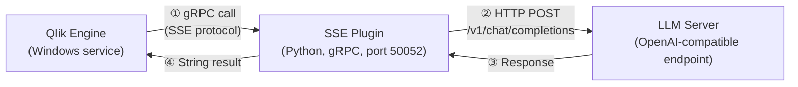

# Pattern 2: LLM in Qlik Expressions

## Business problem

Data teams want to use LLM-generated text directly inside Qlik load scripts or chart expressions and not as a separate UI panel, but as a native part of the Qlik visualization layer, an extension.

**Examples:**

- Classify free-text customer feedback by sentiment during a data reload
- Generate a plain-language summary of a KPI trend inline in a chart expression
- Enrich a data model with LLM-generated categories at load time

```
// Example Qlik expression
SSE.LLMInteraction('Summarize sales trend: ' & Concat(Month & ': ' & Sum(Sales), ', '))
```

---

## Architecture



---

## What is Qlik SSE?

The **[Server-Side Extension (SSE)](https://github.com/qlik-oss/server-side-extension)** protocol is an official Qlik mechanism that allows external services to expose functions callable from Qlik load scripts and chart expressions. Communication uses **[gRPC](https://grpc.io)**, which means:

- The SSE plugin runs as a separate process, not in the browser
- Qlik Engine calls it directly: no browser, no CORS
- Results are returned as native Qlik data types (string, numeric, dual)

This makes SSE better suited than Pattern 1 for **batch processing** or **load-time enrichment**, while Pattern 1 is better for **interactive, session-based** queries tied to the current visualization state.

| | Pattern 1 (Extension + Proxy) | Pattern 2 (SSE) |
|---|---|---|
| Integration point | Browser extension | Qlik Engine |
| Best for | Interactive questions on visible data | Load script enrichment, expression-level results |
| Execution | Per user interaction | Per reload or per expression evaluation |
| CORS dependency | Yes (proxy required) | No |

---

## Components

| Component | Role | Technology |
|-----------|------|-----------|
| Qlik Engine | Initiates gRPC calls when expressions reference `SSE.*` functions | Qlik Sense built-in |
| SSE Plugin | Implements the gRPC server, routes calls to the LLM | Python / grpcio |
| LLM Server | Processes prompts and returns text | Any OpenAI-compatible API (local or remote) |

---

## Data flow

1. A Qlik load script or chart expression calls `SSE.LLMInteraction('...')`.
2. Qlik Engine sends the function arguments to the SSE plugin via gRPC.
3. The SSE plugin formats the arguments as an OpenAI-compatible chat request.
4. The LLM server processes the prompt and returns a text response.
5. The SSE plugin returns the response as a string to Qlik Engine.
6. The result appears in the chart cell or is stored in the data model.

---

## Key considerations

**Synchronous execution:** SSE calls are synchronous from Qlik's perspective. LLM response latency will slow down dashboard rendering or reload jobs if expressions call the function at scale. Keep prompts concise and consider caching strategies for repeated inputs.

**OpenAI compatibility:** Any server implementing `/v1/chat/completions` works — [LM Studio](https://lmstudio.ai), [Ollama](https://ollama.ai), OpenAI, Azure OpenAI, or a custom adapter. The SSE plugin is backend-agnostic.

**Configuration in QMC:** The SSE connection must be registered in the Qlik Management Console under [Analytic connections](https://help.qlik.com/en-US/sense-admin/latest/Subsystems/DeployAdministerQSE/Content/Sense_DeployAdminister/QSEoW/Administer_QSEoW/Managing_QSEoW/analytic-connections-overview.htm) ([setup guide](https://help.qlik.com/en-US/sense-admin/latest/Subsystems/DeployAdministerQSE/Content/Sense_DeployAdminister/QSEoW/Administer_QSEoW/Managing_QSEoW/create-analytic-connection.htm)), specifying the plugin host and port. This is a one-time admin step.

**SSL (optional):** The gRPC connection between Qlik Engine and the SSE plugin can run with or without mutual TLS. SSL is recommended for production environments where the plugin runs on a separate server.

**SSE protocol constraints:** Beyond prompt size and concurrency, using gRPC via the SSE protocol introduces additional constraints — see the [official limitations reference](https://github.com/qlik-oss/server-side-extension/blob/master/docs/limitations.md).

---

## Prerequisites

- [Qlik Sense Enterprise on Windows](https://help.qlik.com/en-US/sense/Content/Sense_Helpsites/Home-Sense.htm) with SSE support enabled in QMC
- Python 3.8+ on the server running the SSE plugin
- An OpenAI-compatible LLM endpoint (local: [LM Studio](https://lmstudio.ai), [Ollama](https://ollama.ai); remote: OpenAI, Azure OpenAI, Anthropic via adapter)
