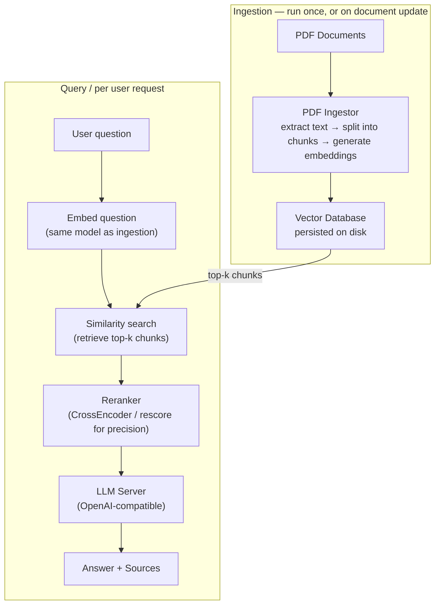

# Pattern 3: RAG Pipeline: Ask Your Documents

## Context

This is a [standalone project](https://github.com/mabaeyens/RAG) built to understand how Retrieval-Augmented Generation works in practice: how documents are ingested, how relevant chunks are retrieved, how a reranker improves precision, and how an LLM produces a grounded answer.

The inspiration was **[Qlik Answers](https://help.qlik.com/en-US/cloud-services/Subsystems/Hub/Content/Sense_Hub/QlikAnswers/Qlik-Answers.htm)** (the document Q&A capability in Qlik Cloud), which is built on RAG principles. This project was developed independently before Qlik Answers was publicly available, not as a replica, but as a hands-on way to understand the architecture from the ground up.

It has no dependency on Qlik Sense and runs entirely as a standalone Python application.

---

## Business problem

Organizations have large volumes of internal documents, like policies, reports, product manuals, contracts, that cannot easily be modeled as structured data. Users need to query these documents in natural language and get answers grounded in the actual content.

**Example:** A compliance officer asks: *"What does our data retention policy say about customer records?"*, and gets an answer sourced from the actual policy document, not from the LLM's training data.

Without RAG, an LLM answers from its training data, which does not include your internal documents. With RAG, it answers from the documents you give it.

---

## Architecture



---

## What is RAG?

**[Retrieval-Augmented Generation (RAG)](https://en.wikipedia.org/wiki/Retrieval-augmented_generation)** prevents LLM hallucination by grounding responses in a specific document corpus:

1. Documents are split into chunks and converted to **vector embeddings**, numerical representations of semantic meaning.
2. At query time, the question is also embedded, and the most semantically similar chunks are retrieved from the vector database.
3. Those chunks are passed to the LLM as context. The model answers based on the retrieved content, not its training data.

A **reranker** (CrossEncoder model) adds a second pass: the top-k retrieved chunks are re-scored against the exact question before being sent to the LLM, improving precision over pure similarity search.

> The RAG pattern was introduced by Lewis et al. (2020) at Meta AI Research: [Retrieval-Augmented Generation for Knowledge-Intensive NLP Tasks](https://arxiv.org/abs/2005.11401).

---

## Components

| Component | Role | Technology |
|-----------|------|-----------|
| PDF Ingestor | Extracts text, splits into chunks, generates embeddings | Python / [PyMuPDF](https://pymupdf.readthedocs.io) / sentence-transformers |
| Vector Database | Persists embeddings for fast similarity search | [ChromaDB](https://www.trychroma.com) (local, on-disk) |
| Query Embedder | Converts user question to a vector for search | sentence-transformers (same model as ingestion) |
| Reranker | Re-scores retrieved chunks against the question | CrossEncoder (`ms-marco-MiniLM-L-6-v2`) |
| LLM Server | Generates the final answer from retrieved context | Any OpenAI-compatible API |

---

## Data flow

**Ingestion (one-time or on document update):**

1. PDFs are read and split into overlapping text chunks.
2. Each chunk is converted to a vector embedding using a local model (`all-MiniLM-L6-v2`).
3. Embeddings and chunk text are stored in ChromaDB on disk.

**Query (per request):**

1. The user's question is embedded using the same model.
2. ChromaDB retrieves the 10 most similar chunks (cosine similarity).
3. The CrossEncoder reranker re-scores those 10 chunks against the exact question.
4. Chunks scoring below the similarity threshold (0.5) are discarded; the top 3 are kept.
5. The selected chunks are assembled into a context prompt, with their relevancy scores included.
6. The LLM generates an answer strictly from that context.
7. The answer and full source traceability are printed separately.

---

## Source traceability

Each response is accompanied by the sources that supported it:

```
Answer: [LLM response]

Sources:
Source 1:
  Initial Score:   0.8423
  Reranking Score: 12.4571
  Document: company_policy.pdf
  Page: 4
  Content: "Customer records must be retained for a minimum of..."
```

The dual scoring (initial similarity + reranking score) shows both why a chunk was retrieved and how relevant it proved to be after closer comparison against the question.

---

## Conversational mode

The pipeline maintains a rolling conversation history (last 5 turns). Users can ask follow-up questions without repeating context, making it closer to a document Q&A session than a single-query lookup.

---

## Key considerations

**Local-first by design:** Embeddings and reranking run on local models. ChromaDB persists to disk. No data leaves the machine during ingestion or retrieval. The LLM call is the only potential external dependency, and that too can run locally via [LM Studio](https://lmstudio.ai) or [Ollama](https://ollama.ai).

**Document freshness:** The vector database must be re-ingested when source documents change. For frequently updated document sets, incremental ingestion is preferable to a full rebuild.

**Chunk size tuning:** Retrieval quality depends significantly on chunk size. Larger chunks preserve context but reduce precision; smaller chunks are more precise but may lose surrounding context. Tuning is required per document type.

**Prompt and response guardrails:** Production RAG systems should include input/output sanitization, filtering for bias, sensitive data, confidentiality, and content safety (e.g. [llm-guard](https://pypi.org/project/llm-guard/)). This was explored during development but removed due to GPU performance constraints in the test environment (a laptop with a limited graphics card). It remains an important architectural consideration for any production deployment.

---

## Next steps

**Multi-format support:** The current ingestor handles PDFs, which served to illustrate the RAG pipeline end-to-end. A natural extension would be to support additional document types, plain text, PowerPoint, Excel, HTML, and others, each requiring its own extraction logic before the chunking and embedding stages remain unchanged.

**Conversational memory:** The current rolling history is limited to the last few turns and is not persisted across sessions. Adding a memory layer, whether storing summaries, key facts extracted from past conversations, or full session logs, would make the system significantly more useful for ongoing document Q&A workflows.

---

## Prerequisites

- Python 3.8+
- ChromaDB installed locally
- sentence-transformers models (downloaded automatically on first run)
- An OpenAI-compatible LLM endpoint for answer generation (local or remote)
