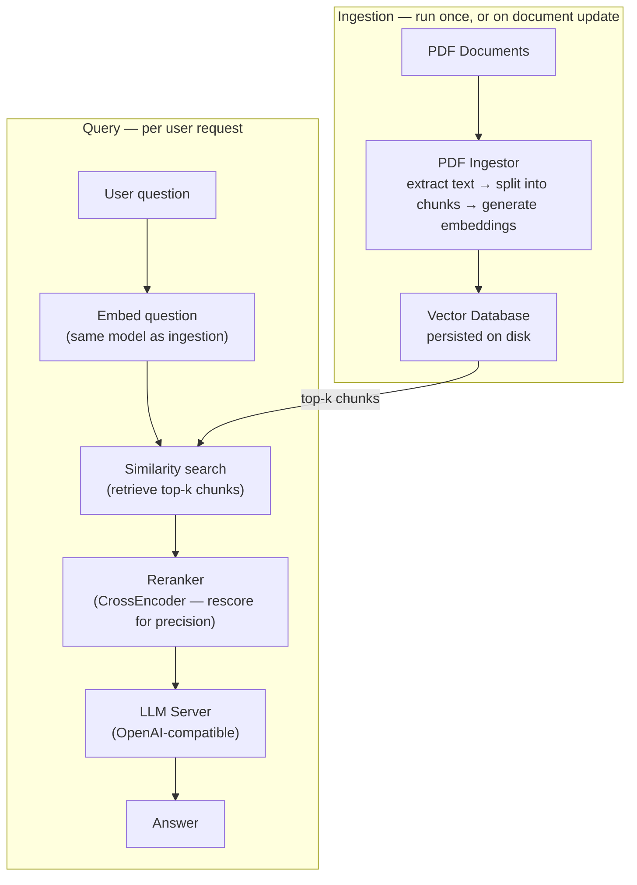

# Pattern 3 — Ask Your Documents

## Business problem

Organizations have large volumes of internal documents — policies, reports, product manuals, contracts — that are not in Qlik and cannot easily be modeled as structured data. Users need to query these documents in natural language and get answers grounded in the actual content.

**Example:** A compliance officer asks: *"What does our data retention policy say about customer records?"* — and gets an answer sourced from the actual policy document, not a hallucinated response.

Without RAG, an LLM will answer from its training data, which does not include your internal documents. With RAG, it answers from the document you gave it.

---

## Architecture

---

## What is RAG?

**Retrieval-Augmented Generation (RAG)** prevents LLM hallucination by grounding responses in a specific document corpus:

1. Documents are split into chunks and converted to **vector embeddings** — numerical representations of semantic meaning.
2. At query time, the question is also embedded, and the most semantically similar chunks are retrieved from the vector database.
3. Those chunks are passed to the LLM as context. The model answers based on the retrieved content, not its training data.

A **reranker** (CrossEncoder model) adds a second pass: the top-k retrieved chunks are re-scored against the specific question before being passed to the LLM, improving answer precision.

---

## Components

| Component | Role | Technology |
|-----------|------|-----------|
| PDF Ingestor | Extracts text, splits into chunks, generates embeddings | Python / PyMuPDF / sentence-transformers |
| Vector Database | Persists embeddings for fast similarity search | ChromaDB (local, on-disk) |
| Query Embedder | Converts user question to a vector for search | sentence-transformers (same model as ingestion) |
| Reranker | Re-scores retrieved chunks for answer precision | CrossEncoder (sentence-transformers) |
| LLM Server | Generates the final answer from retrieved context | Any OpenAI-compatible API |

---

## Data flow

**Ingestion (one-time or scheduled):**

1. PDFs are read and split into overlapping text chunks.
2. Each chunk is converted to a vector embedding using a local model.
3. Embeddings and chunk text are stored in ChromaDB on disk.

**Query (per request):**

1. The user's question is embedded using the same model.
2. ChromaDB retrieves the top-k most similar chunks (cosine similarity).
3. The CrossEncoder reranker re-scores those chunks against the exact question.
4. The top reranked chunks are assembled into a context prompt.
5. The LLM generates an answer grounded in that context.

---

## Key considerations

**Local-first by design:** Embeddings are generated with a local `sentence-transformers` model. ChromaDB persists to disk. No data leaves the machine during ingestion or retrieval. The LLM call is the only potential external dependency — and that too can run locally.

**Document freshness:** The vector database must be re-ingested when source documents change. For frequently updated document sets, consider scheduling incremental ingestion rather than full re-ingestion.

**Chunk size tuning:** Answer quality depends significantly on how documents are chunked. Larger chunks preserve context but reduce retrieval precision; smaller chunks are more precise but may lose context. This requires tuning per document type and use case.

**Relation to Qlik:** This pipeline is standalone and does not integrate directly with the Qlik Engine. Results can be surfaced in Qlik by writing LLM outputs to a data source (database, flat file) that Qlik reloads, or by exposing the pipeline as an API consumed by Pattern 1 or 2.

---

## Prerequisites

- Python 3.10+
- ChromaDB installed locally
- sentence-transformers models (downloaded automatically on first run)
- An OpenAI-compatible LLM endpoint for answer generation (local or remote)
